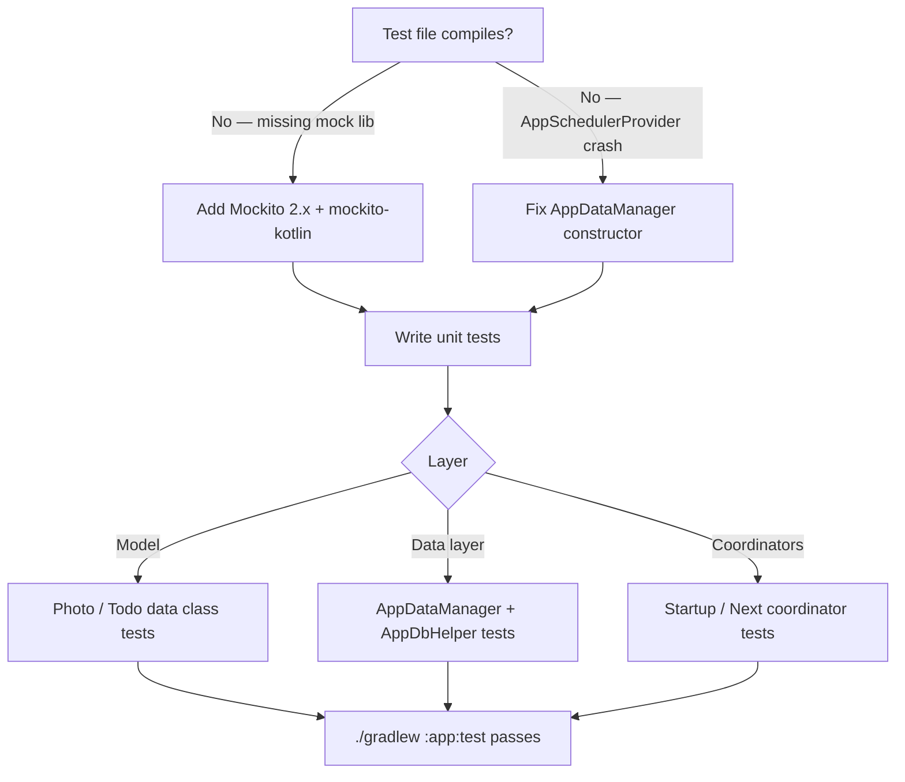

# Technical Specification: CRM-192 - Increase Unit Test Coverage

**Status:** Draft
**Author:** Tech Lead Agent
**Created:** 2026-05-18

---

## 🎯 Problem

### Context

The project is a multi-module Android application using MVVM, Dagger 2, RxJava 2, and Room.
The three Gradle modules are `:app`, `:android_framework` (submodule), and `:android_model` (submodule).

### Current State

The entire test suite consists of **one trivial test**:

```
app/src/test/java/com/gl/kev/app/ExampleUnitTest.kt
  └── addition_isCorrect()  →  assertEquals(4, 2 + 2)
```

Analysis of the source tree (27 Kotlin files across three modules) reveals:

| Layer | Files | Meaningful tests |
|-------|-------|-----------------|
| `:android_model` — `Photo`, `Todo`, `PhotoResponse`, `TodoResponse` | 3 | 0 |
| `:android_framework` — `BaseDataManager`, `SchedulerProvider` | 5 | 0 |
| `:app` data — `AppDataManager`, `AppDbHelper`, `AppApiHelper` | 6 | 0 |
| `:app` coordinators — `StarupCoordinator`, `NextCoordinator`, `RootFlowCoordinator`, `Navigator` | 4 | 0 |
| `:app` DI / UI / utils | 9 | 0 |

**Two blockers prevent even writing unit tests today:**

1. **No mocking library**: `app/build.gradle` declares only `testImplementation 'junit:junit:4.12'`.
   Mockito or a Kotlin-compatible alternative is absent; the pattern
   `mock(ApiHelper::class.java)` shown in `docs/testing-standards.md` cannot compile.

2. **`AppDataManager` is JVM-untestable**: The class calls `BaseDataManager()` with no
   arguments, which defaults to `AppSchedulerProvider()`. That provider calls
   `AndroidSchedulers.mainThread()` — an Android-runtime-only scheduler. Any attempt to
   instantiate `AppDataManager` in a local JVM test throws
   `java.lang.RuntimeException: Method mainThread in android.os.Looper not mocked`.

### Desired State

- All compilable unit tests pass via `./gradlew :app:test` (no device required).
- Meaningful coverage across model, data layer, and coordinator layers.
- A `TestSchedulerProvider` helper exists in the test source set so every future test
  can substitute synchronous schedulers without boilerplate.
- Test dependency graph is minimal and version-pinned.

### Impact

Without these changes, the codebase has 0% meaningful test coverage, regressions go
undetected, and the test task always runs (and passes) with a single trivially-true assertion
that provides no quality signal.

---

## 📋 Architectural Decisions

### Decision 1 — Mocking Library

The testing-standards.md (`## Mocking Strategy`) shows Mockito-style syntax:
`mock(ApiHelper::class.java)` and `` `when`(mockApiHelper.doGetPhotos()).thenReturn(...) ``.
The project uses JUnit 4.12, Kotlin 1.3.21, and AGP 3.4.0.

| Option | Description | Pros | Cons | Effort |
|--------|-------------|------|------|--------|
| **A — Mockito 2.x + mockito-kotlin** | Add `mockito-core:2.25.1` and `mockito-kotlin:2.2.0` | Matches syntax in testing-standards.md; stable with JUnit 4; no extra byte-buddy version conflicts at Kotlin 1.3 | Verbose for Kotlin: nullable vs non-null requires `any<T>()` helpers from mockito-kotlin | Low |
| B — MockK | Add `mockk:1.9.3` (Kotlin-native) | Idiomatic Kotlin, no `any<T>()` workarounds; better coroutine support | Syntax differs from what testing-standards.md illustrates; higher learning curve for team already familiar with Mockito | Low |
| C — Manual fakes | Write hand-rolled `FakeApiHelper`, `FakeDbHelper` | Zero new dependencies | High boilerplate per interface; diverges quickly as interfaces grow; no verification capabilities | High |

**Decision: Option A — Mockito 2.x + mockito-kotlin**

Rationale: The testing-standards.md establishes Mockito as the expected mocking API
(literal syntax is shown verbatim). Consistency with documented standards outweighs
MockK's ergonomic advantages. `mockito-kotlin` resolves Kotlin null-safety friction.
Both libraries are binary-compatible with Kotlin 1.3.21 and JUnit 4.

---

### Decision 2 — Injecting `SchedulerProvider` into `AppDataManager` for Tests

`AppDataManager` currently delegates scheduling to `BaseDataManager()` (no-arg),
which hard-codes `AppSchedulerProvider` (Android-only). Any JVM unit test that
instantiates `AppDataManager` crashes with `Looper not mocked`.

`BaseDataManager` already accepts a `SchedulerProvider` constructor parameter:
```kotlin
abstract class BaseDataManager(val mSchedulerProvider: SchedulerProvider = AppSchedulerProvider())
```
The issue is `AppDataManager` does not forward a custom provider.

| Option | Description | Pros | Cons | Effort |
|--------|-------------|------|------|--------|
| **A — Secondary @Inject constructor** | Keep the no-arg-DI constructor; add a primary constructor that accepts `SchedulerProvider` for tests | `@Inject` constructor unchanged for Dagger; test constructor clearly signals intent; no interface change | Kotlin secondary constructor syntax is mildly unusual for readers coming from Java | Low |
| B — Add `SchedulerProvider` to the `@Inject` constructor | Dagger injects `SchedulerProvider` alongside `DbHelper`/`ApiHelper`; register `AppSchedulerProvider` in Dagger module | Fully DI-managed, no special test constructor | Requires adding `@Provides AppSchedulerProvider` to a Dagger module and a binding for the abstract `SchedulerProvider` interface — scope touches DI wiring | Medium |
| C — Expose a package-private setter (`@VisibleForTesting`) | After construction, swap in a test scheduler via setter | No constructor signature changes | Mutable state; scheduler can be accidentally replaced in production; anti-pattern for immutable design | Low |

**Decision: Option A — Secondary `@Inject` constructor in `AppDataManager`**

Rationale: The production Dagger graph is untouched (only two params). Tests pass the
third parameter directly using constructor injection — exactly the pattern advocated in
testing-standards.md (`## Mocking Strategy > Use constructor injection … to inject mocks
without reflection`). The code-conventions.md (`## Dependency Injection`) confirms
constructor injection is the preferred pattern for data/service classes.

**Minimal change to `AppDataManager.kt`:**
```kotlin
// Primary constructor (used by tests)
class AppDataManager(
    private val mDbHelper: DbHelper,
    private val mApiHelper: ApiHelper,
    schedulerProvider: SchedulerProvider
) : DataManager, BaseDataManager(schedulerProvider) {

    // Secondary constructor — used by Dagger @Inject
    @Inject
    constructor(mDbHelper: DbHelper, mApiHelper: ApiHelper) :
        this(mDbHelper, mApiHelper, AppSchedulerProvider())

    // ... method bodies unchanged
}
```

---

### Decision 3 — Scope of Test Layers (Unit vs Instrumented)

| Option | Description | Pros | Cons | Effort |
|--------|-------------|------|------|--------|
| **A — JVM unit tests only (this ticket)** | Target model, data layer, and coordinator layers on JVM; leave Room DAO coverage to future instrumented work | No emulator/device required; fast CI; unblocks coverage immediately | Room DAOs require an Android device for real SQL coverage | Low |
| B — JVM unit tests + Room instrumented tests | Add in-memory Room tests for `PhotoDao` and `TodoDao` in `androidTest/` | Highest fidelity for DB layer | Requires emulator; increases CI setup complexity for a codebase with no CI today | High |

**Decision: Option A — JVM unit tests only**

Rationale: The task asks to "have it fully compilable with no errors" and increase
coverage. Room DAOs are thin @Query annotations — the highest-value, lowest-risk
tests are in the data and coordinator layers. `docs/testing-standards.md` also
notes "prefer local unit tests over instrumented tests where the Android framework
is not needed." Room DAO instrumented tests are explicitly called out as future work
in the Out of Scope section.

---

## 🔄 Decision Flow



---

## 🏗️ Architecture

The change is additive: no new production architecture is introduced.
Two production files are modified to remove testability blockers; all other changes
are new test-only files.

```
app/
├── build.gradle                              ← ADD Mockito deps
└── src/
    ├── main/java/com/gl/kev/app/
    │   └── data/
    │       └── AppDataManager.kt             ← ADD secondary @Inject constructor
    └── test/java/com/gl/kev/app/
        ├── ExampleUnitTest.kt                (existing, unchanged)
        ├── utils/
        │   └── TestSchedulerProvider.kt      ← NEW: trampoline schedulers
        ├── data/
        │   ├── AppDataManagerTest.kt         ← NEW
        │   └── local/db/
        │       └── AppDbHelperTest.kt        ← NEW
        └── coordinator/
            ├── StarupCoordinatorTest.kt      ← NEW
            ├── NextCoordinatorTest.kt        ← NEW
            └── RootFlowCoordinatorTest.kt    ← NEW
```

### Data Flow Under Test

```
AppDataManagerTest
  ↓ constructs with mocks
AppDataManager(mockDbHelper, mockApiHelper, TestSchedulerProvider)
  ↓ delegates to
mockApiHelper.doGetPhotos() → Observable.just(fakePhotos)  [Mockito stub]
  ↓ subscribeOn(trampoline).observeOn(trampoline)
Consumer<PhotoResponse>  →  assert result
```

---

## 💻 Implementation

### Step 1 — Update `app/build.gradle` (test dependencies)

```groovy
// app/build.gradle — testImplementation section
testImplementation 'junit:junit:4.12'
testImplementation 'org.mockito:mockito-core:2.25.1'
testImplementation 'com.nhaarman.mockitokotlin2:mockito-kotlin:2.2.0'
```

> `mockito-kotlin` is the maintained successor to `nhaarman/mockito-kotlin`; version 2.2.0
> is the last release targeting Java/Kotlin < 1.5 and is compatible with Kotlin 1.3.21.
> Do not add `mockito-android`; that is only needed for instrumented tests.

---

### Step 2 — Modify `AppDataManager.kt`

**File:** `app/src/main/java/com/gl/kev/app/data/AppDataManager.kt`

Replace the primary constructor + class declaration:

```kotlin
// BEFORE
class AppDataManager @Inject constructor(
    private val mDbHelper: DbHelper,
    private val mApiHelper: ApiHelper
) : DataManager, BaseDataManager() {
```

```kotlin
// AFTER
class AppDataManager(
    private val mDbHelper: DbHelper,
    private val mApiHelper: ApiHelper,
    schedulerProvider: SchedulerProvider
) : DataManager, BaseDataManager(schedulerProvider) {

    @Inject
    constructor(mDbHelper: DbHelper, mApiHelper: ApiHelper) :
        this(mDbHelper, mApiHelper, AppSchedulerProvider())
```

Add the missing imports at the top of the file:
```kotlin
import com.gl.kev.framework.utils.rx.AppSchedulerProvider
import com.gl.kev.framework.utils.rx.SchedulerProvider
```

No other changes to `AppDataManager` — method bodies are unchanged.

---

### Step 3 — Create `TestSchedulerProvider.kt`

**File:** `app/src/test/java/com/gl/kev/app/utils/TestSchedulerProvider.kt`

```kotlin
package com.gl.kev.app.utils

import com.gl.kev.framework.utils.rx.SchedulerProvider
import io.reactivex.Scheduler
import io.reactivex.schedulers.Schedulers

class TestSchedulerProvider : SchedulerProvider {
    override fun ui(): Scheduler = Schedulers.trampoline()
    override fun io(): Scheduler = Schedulers.trampoline()
    override fun computation(): Scheduler = Schedulers.trampoline()
}
```

`Schedulers.trampoline()` runs work on the calling thread synchronously, making RxJava
chains testable without `TestObserver.await()` or `Thread.sleep()`.
(See `docs/testing-standards.md` § *Mocking Strategy > Unit Tests*.)

---

### Step 4 — Create `AppDataManagerTest.kt`

**File:** `app/src/test/java/com/gl/kev/app/data/AppDataManagerTest.kt`

```kotlin
package com.gl.kev.app.data

import com.gl.kev.app.data.api.ApiHelper
import com.gl.kev.app.data.local.db.AppDbHelper
import com.gl.kev.app.data.local.db.DbHelper
import com.gl.kev.app.data.local.db.dao.PhotoDao
import com.gl.kev.app.utils.TestSchedulerProvider
import com.gl.kev.model.Photo
import com.gl.kev.model.Todo
import com.gl.kev.model.io.PhotoResponse
import com.gl.kev.model.io.TodoResponse
import com.nhaarman.mockitokotlin2.mock
import com.nhaarman.mockitokotlin2.verify
import com.nhaarman.mockitokotlin2.whenever
import io.reactivex.Observable
import io.reactivex.functions.Consumer
import org.junit.Assert.assertEquals
import org.junit.Assert.fail
import org.junit.Before
import org.junit.Test

class AppDataManagerTest {

    private val mockApiHelper: ApiHelper = mock()
    private val mockDbHelper: DbHelper = mock()
    private lateinit var dataManager: AppDataManager

    @Before
    fun setUp() {
        dataManager = AppDataManager(mockDbHelper, mockApiHelper, TestSchedulerProvider())
    }

    // --- getPhotos ---

    @Test
    fun getPhotos_onSuccess_passesResponseToConsumer() {
        val fakePhotos = PhotoResponse().apply {
            add(Photo(1, 1, "title", "http://url", "http://thumb"))
            add(Photo(2, 1, "title2", "http://url2", "http://thumb2"))
        }
        whenever(mockApiHelper.doGetPhotos()).thenReturn(Observable.just(fakePhotos))

        var result: PhotoResponse? = null
        dataManager.getPhotos(
            Consumer { result = it },
            Consumer { fail("Should not error: ${it.message}") }
        )

        assertEquals(2, result?.size)
        assertEquals(1, result?.get(0)?.id)
    }

    @Test
    fun getPhotos_onError_passesThrowableToFailureConsumer() {
        val error = RuntimeException("network error")
        whenever(mockApiHelper.doGetPhotos()).thenReturn(Observable.error(error))

        var caughtError: Throwable? = null
        dataManager.getPhotos(
            Consumer { fail("Should not succeed") },
            Consumer { caughtError = it }
        )

        assertEquals("network error", caughtError?.message)
    }

    // --- getTodos ---

    @Test
    fun getTodos_onSuccess_passesResponseToConsumer() {
        val fakeTodos = TodoResponse().apply {
            add(Todo(1, 1, "buy milk", false))
        }
        whenever(mockApiHelper.doGetTodos()).thenReturn(Observable.just(fakeTodos))

        var result: TodoResponse? = null
        dataManager.getTodos(
            Consumer { result = it },
            Consumer { fail("Should not error: ${it.message}") }
        )

        assertEquals(1, result?.size)
        assertEquals("buy milk", result?.get(0)?.title)
    }

    @Test
    fun getTodos_onError_passesThrowableToFailureConsumer() {
        val error = RuntimeException("timeout")
        whenever(mockApiHelper.doGetTodos()).thenReturn(Observable.error(error))

        var caughtError: Throwable? = null
        dataManager.getTodos(
            Consumer { fail("Should not succeed") },
            Consumer { caughtError = it }
        )

        assertEquals("timeout", caughtError?.message)
    }

    // --- getAndSavePhotos ---

    @Test
    fun getAndSavePhotos_onSuccess_insertsPhotosViaDao() {
        val fakePhotos = PhotoResponse().apply {
            add(Photo(1, 1, "title", "http://url", "http://thumb"))
        }
        val mockPhotoDao: PhotoDao = mock()
        whenever(mockApiHelper.doGetPhotos()).thenReturn(Observable.just(fakePhotos))
        whenever(mockDbHelper.getPhotoDao()).thenReturn(mockPhotoDao)

        dataManager.getAndSavePhotos(Consumer { fail("Should not error: ${it.message}") })

        verify(mockPhotoDao).insertAll(fakePhotos)
    }

    // --- helpers ---

    @Test
    fun getDbHelper_returnsInjectedDbHelper() {
        assertEquals(mockDbHelper, dataManager.getDbHelper())
    }

    @Test
    fun getApiHelper_returnsInjectedApiHelper() {
        assertEquals(mockApiHelper, dataManager.getApiHelper())
    }
}
```

---

### Step 5 — Create `AppDbHelperTest.kt`

**File:** `app/src/test/java/com/gl/kev/app/data/local/db/AppDbHelperTest.kt`

```kotlin
package com.gl.kev.app.data.local.db

import com.gl.kev.app.data.local.db.dao.PhotoDao
import com.gl.kev.app.data.local.db.dao.TodoDao
import com.nhaarman.mockitokotlin2.mock
import com.nhaarman.mockitokotlin2.whenever
import org.junit.Assert.assertEquals
import org.junit.Before
import org.junit.Test

class AppDbHelperTest {

    private val mockDatabase: AppDataBase = mock()
    private val mockPhotoDao: PhotoDao = mock()
    private val mockTodoDao: TodoDao = mock()
    private lateinit var appDbHelper: AppDbHelper

    @Before
    fun setUp() {
        whenever(mockDatabase.photoDao()).thenReturn(mockPhotoDao)
        whenever(mockDatabase.todoDao()).thenReturn(mockTodoDao)
        appDbHelper = AppDbHelper(mockDatabase)
    }

    @Test
    fun getPhotoDao_delegatesToDatabase() {
        assertEquals(mockPhotoDao, appDbHelper.getPhotoDao())
    }

    @Test
    fun getTodoDao_delegatesToDatabase() {
        assertEquals(mockTodoDao, appDbHelper.getTodoDao())
    }
}
```

---

### Step 6 — Create Coordinator Tests

**File:** `app/src/test/java/com/gl/kev/app/coordinator/StarupCoordinatorTest.kt`

```kotlin
package com.gl.kev.app.coordinator

import org.junit.Assert.assertNotNull
import org.junit.Assert.assertNull
import org.junit.Test

class StarupCoordinatorTest {

    @Test
    fun constructor_acceptsNullNextNavigation() {
        val coordinator = StarupCoordinator(nextNavigation = null)
        assertNull(coordinator.nextNavigation)
    }

    @Test
    fun constructor_storesNextNavigationLambda() {
        var invoked = false
        val coordinator = StarupCoordinator(nextNavigation = { invoked = true })
        assertNotNull(coordinator.nextNavigation)
        coordinator.nextNavigation?.invoke()
        assert(invoked)
    }
}
```

**File:** `app/src/test/java/com/gl/kev/app/coordinator/NextCoordinatorTest.kt`

```kotlin
package com.gl.kev.app.coordinator

import org.junit.Assert.assertNotNull
import org.junit.Assert.assertNull
import org.junit.Test

class NextCoordinatorTest {

    @Test
    fun constructor_acceptsNullNextNavigation() {
        val coordinator = NextCoordinator(nextNavigation = null)
        assertNull(coordinator.nextNavigation)
    }

    @Test
    fun constructor_storesNextNavigationLambda() {
        var invoked = false
        val coordinator = NextCoordinator(nextNavigation = { invoked = true })
        assertNotNull(coordinator.nextNavigation)
        coordinator.nextNavigation?.invoke()
        assert(invoked)
    }
}
```

**File:** `app/src/test/java/com/gl/kev/app/coordinator/RootFlowCoordinatorTest.kt`

```kotlin
package com.gl.kev.app.coordinator

import com.nhaarman.mockitokotlin2.mock
import org.junit.Assert.assertNotNull
import org.junit.Test

class RootFlowCoordinatorTest {

    private val mockNavigator: Navigator = mock()

    @Test
    fun constructor_initializesWithoutThrowingException() {
        val coordinator = RootFlowCoordinator(mockNavigator)
        assertNotNull(coordinator)
    }
}
```

> Note: `RootFlowCoordinator` currently has no behavioural methods worth asserting
> (both `toNextActivity()` and `toMainActivity()` are empty stubs). The constructor
> test verifies the wiring is sound. Expand when navigation logic is implemented.

---

### Step 7 — (Optional) Model Data Class Tests

The model classes (`Photo`, `Todo`, `PhotoResponse`, `TodoResponse`) are Kotlin
`data class`es. Their `equals()`, `hashCode()`, and `copy()` are compiler-generated
and do not need explicit unit tests. However, if the team wants to assert field access
and response wrapper behaviour, these can be co-located in a `model/` package under
`app/src/test/`.

<details>
<summary>Example model test (optional)</summary>

```kotlin
package com.gl.kev.app.model

import com.gl.kev.model.Photo
import com.gl.kev.model.Todo
import com.gl.kev.model.io.PhotoResponse
import com.gl.kev.model.io.TodoResponse
import org.junit.Assert.*
import org.junit.Test

class ModelTest {

    @Test
    fun photo_equalityUsesAllFields() {
        val a = Photo(1, 1, "title", "url", "thumb")
        val b = Photo(1, 1, "title", "url", "thumb")
        assertEquals(a, b)
    }

    @Test
    fun photo_copy_changesOnlySpecifiedField() {
        val original = Photo(1, 1, "title", "url", "thumb")
        val copy = original.copy(title = "new title")
        assertEquals("new title", copy.title)
        assertEquals(original.id, copy.id)
    }

    @Test
    fun todo_completedFieldIsMutable() {
        val todo = Todo(1, 1, "task", false)
        todo.completed = true
        assertTrue(todo.completed)
    }

    @Test
    fun photoResponse_isArrayListSubclass() {
        val response = PhotoResponse()
        response.add(Photo(1, 1, "t", "u", "th"))
        assertEquals(1, response.size)
        assertTrue(response is ArrayList<*>)
    }

    @Test
    fun todoResponse_isArrayListSubclass() {
        val response = TodoResponse()
        response.add(Todo(1, 1, "t", false))
        assertEquals(1, response.size)
    }
}
```
</details>

---

## ✅ Testing Strategy

### Framework and Execution

- **Framework:** JUnit 4.12 + Mockito 2.25.1 + mockito-kotlin 2.2.0
- **Runner:** JVM (no device required)
- **Command:** `./gradlew :app:test`

### Coverage Targets

Per `docs/testing-standards.md`:

| Class | Target | Tests planned |
|-------|--------|---------------|
| `AppDataManager` | ≥ 80% | 7 (getPhotos ×2, getTodos ×2, getAndSavePhotos ×1, helpers ×2) |
| `AppDbHelper` | ≥ 80% | 2 (getPhotoDao, getTodoDao) |
| `StarupCoordinator` | ≥ 60% | 2 (null lambda, invoked lambda) |
| `NextCoordinator` | ≥ 60% | 2 (null lambda, invoked lambda) |
| `RootFlowCoordinator` | ≥ 60% | 1 (constructor wiring) |

Total new tests: **14** (across 5 test classes, plus optional model tests).

### Test Patterns Applied

1. **AAA pattern** (Arrange / Act / Assert) per `docs/testing-standards.md`.
2. **`TestSchedulerProvider`** uses `Schedulers.trampoline()` — no async waits needed.
3. **Constructor injection** with mocks — no reflection, no Robolectric.
4. **Method naming** follows `methodUnderTest_stateOrInput_expectedBehavior` snake_case.

### Example — Error Path Test

```kotlin
@Test
fun getPhotos_onError_passesThrowableToFailureConsumer() {
    // Arrange
    val error = RuntimeException("network error")
    whenever(mockApiHelper.doGetPhotos()).thenReturn(Observable.error(error))

    // Act
    var caughtError: Throwable? = null
    dataManager.getPhotos(
        Consumer { fail("Should not succeed") },
        Consumer { caughtError = it }
    )

    // Assert
    assertEquals("network error", caughtError?.message)
}
```

### What is NOT tested here (see Out of Scope)

- Room DAOs — require in-memory database, device/emulator (instrumented tests)
- `AppApiHelper` — wraps `Rx2AndroidNetworking` which calls `OkHttp`; needs integration test
- ViewModels — require `Application` context (`AndroidViewModel`); Robolectric or instrumented
- `BaseDataManager.timeOut()` — wraps `Thread.sleep()`; timer testing needs `TestScheduler`

---

## 🔒 Security Considerations

This change adds test-only infrastructure; no production security surface is affected.

- [x] No secrets introduced in test files (test data uses placeholder URLs / strings)
- [x] `mockito-core` and `mockito-kotlin` are `testImplementation` scope — not bundled in APK
- [x] No new `BuildConfig` fields or permissions added
- [x] `AppDataManager` constructor change does not alter the Dagger-wired production path
- [x] No new network calls, file I/O, or external dependencies in tests

---

## ✅ Definition of Done

### Implementation
- [ ] `app/build.gradle` — Mockito and mockito-kotlin added under `testImplementation`
- [ ] `AppDataManager.kt` — Primary constructor takes `SchedulerProvider`; `@Inject` moved to secondary constructor; imports for `AppSchedulerProvider` and `SchedulerProvider` added
- [ ] `TestSchedulerProvider.kt` created in `app/src/test/java/com/gl/kev/app/utils/`
- [ ] `AppDataManagerTest.kt` created with 7 tests
- [ ] `AppDbHelperTest.kt` created with 2 tests
- [ ] `StarupCoordinatorTest.kt` created with 2 tests
- [ ] `NextCoordinatorTest.kt` created with 2 tests
- [ ] `RootFlowCoordinatorTest.kt` created with 1 test

### Quality
- [ ] `./gradlew :app:test` exits with BUILD SUCCESSFUL (zero test failures, zero compilation errors)
- [ ] No new Lint errors introduced
- [ ] All test method names follow `methodUnderTest_stateOrInput_expectedBehavior` pattern per `docs/testing-standards.md`
- [ ] No `Thread.sleep()` in any test
- [ ] Every `Consumer<Throwable>` path has a corresponding test (error paths are not silent)

### Compatibility
- [ ] Existing `ExampleUnitTest.kt` still passes unchanged
- [ ] Dagger-generated code compiles without kapt errors (`./gradlew :app:kaptDebugKotlin`)
- [ ] `./gradlew :app:assembleDebug` (production build) is unaffected by the constructor change

---

## 🚫 Out of Scope

- **Room DAO instrumented tests** (`PhotoDao`, `TodoDao`) — require an in-memory Room
  database running on Android; deferred to a future instrumented test story.
- **ViewModel unit tests** (`MainViewModel`, `StartupViewModel`, `NextViewModel`) — these
  use field injection via `ApplicationComponent.inject(this)`, which requires a real
  `Application` instance. Robolectric integration or a dedicated DI refactor is a
  separate effort.
- **`AppApiHelper` tests** — the class is a thin wrapper around `Rx2AndroidNetworking`
  (an OkHttp-backed library). Meaningful testing requires either a mock web server
  (OkHttp `MockWebServer`) or a separate integration test suite.
- **`BaseDataManager.timeOut()` timer test** — uses `Thread.sleep()` internally; testing
  it properly requires `TestScheduler.advanceTimeBy()` and is a low-value edge case.
- **CI/CD pipeline setup** — `docs/testing-standards.md` provides a GitHub Actions YAML
  template; this is a separate ops ticket.
- **Code coverage reporting** — Jacoco or similar coverage enforcement is not configured;
  coverage targets above are advisory.

---

## 📚 References

- `docs/testing-standards.md` — JUnit 4 setup, mocking strategy, naming conventions, `TestSchedulerProvider` pattern, AAA structure
- `docs/tech.md` — Kotlin 1.3.21, RxJava 2.1.12, Dagger 2.21, JUnit 4.12 versions
- `docs/structure.md` — `app/src/test/` directory layout, module responsibilities
- `docs/code-conventions.md` — Kotlin constructor patterns, `@Inject` conventions, error handling with `Consumer<Throwable>`
- `docs/api-standards.md` — `ApiHelper` interface methods; verifying `doGetPhotos()` / `doGetTodos()` is called
- Mockito 2.x docs: https://javadoc.io/doc/org.mockito/mockito-core/2.25.1/
- mockito-kotlin 2.2.0: https://github.com/nhaarman/mockito-kotlin/tree/2.2.0
