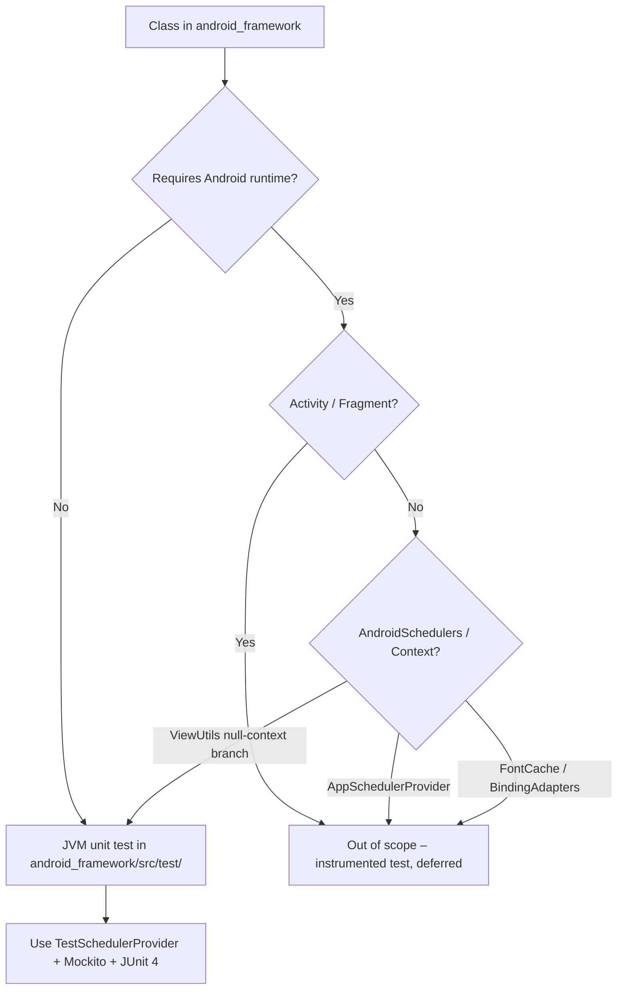

# Technical Specification: CRM-193 - Increase Unit Test Coverage in android_framework Submodule

**Status:** Draft
**Author:** Tech Lead Agent
**Created:** 2026-05-18

---

## 🎯 Problem

### Context

The `:android_framework` module is a Git submodule (`android_framework/`) that supplies reusable base classes to all screens in the `:app` module:

| Class | Location | Purpose |
|---|---|---|
| `BaseDataManager` | `data/BaseDataManager.kt` | Manages `CompositeDisposable`, injects `SchedulerProvider`, exposes `genericCallable()` and `timeOut()` helpers |
| `GenericListConverter` | `data/converter/GenericListConverter.kt` | Room `@TypeConverter` pair: `listToJson` / `jsonToList` using Gson; contains an inline `//TODO: test this...` comment |
| `SchedulerProvider` | `utils/rx/SchedulerProvider.kt` | RxJava scheduler abstraction interface (`ui()`, `computation()`, `io()`) |
| `AppSchedulerProvider` | `utils/rx/AppSchedulerProvider.kt` | Production impl delegating to `AndroidSchedulers.mainThread()`, `Schedulers.computation()`, `Schedulers.io()` |
| `ViewUtils` | `utils/ViewUtils.kt` | `getColor()` helper; nullable-context-safe |
| `FontCache` | `utils/FontCache.kt` | Asset-backed `Typeface` cache (lazy load + `ArrayMap` store) |
| `BindingAdapters` | `utils/BindingAdapters.kt` | `@BindingAdapter` functions: `font` (delegates to `FontCache`), `showIfNull` (visibility toggle) |
| `BaseActivity` | `ui/BaseActivity.kt` | Generic `AppCompatActivity` with reflection-based ViewModel init, Data Binding setup, network check, and alert dialog helpers |
| `BaseFragment` | `ui/BaseFragment.kt` | Generic `Fragment` mirroring `BaseActivity`; shares ViewModel with host Activity |

### Current State

- **No test sources exist** in `android_framework/src/test/` or `android_framework/src/androidTest/`. The module's `build.gradle` lists `testInstrumentationRunner` but does not declare any test dependencies (no JUnit, no Mockito).
- The only test in the repository is the placeholder `ExampleUnitTest.kt` in `:app`, which verifies `2 + 2 == 4`.
- Per `docs/testing-standards.md`, the coverage target for base classes is ≥ 60%; there is currently 0% coverage for any class in `:android_framework`.
- `GenericListConverter` contains an explicit developer TODO to test the conversion logic.

### Desired State

A test source set is added to the `:android_framework` module with unit test files covering all testable pure-JVM logic. The coverage target for this module is **≥ 60%** as defined in `docs/testing-standards.md`. Classes that require the Android framework at runtime (`BaseActivity`, `BaseFragment`, `AppSchedulerProvider`, `FontCache`, `BindingAdapters`) are explicitly out of scope for JVM unit tests and are deferred to instrumented tests.

### Impact

- Eliminates the developer TODO in `GenericListConverter`
- Validates critical RxJava lifecycle behavior in `BaseDataManager` (disposal, re-creation after dispose, `timeOut` delegate)
- Establishes the test infrastructure (build.gradle dependencies, `TestSchedulerProvider`) that `:app`-level tests and future contributors can rely upon
- Reduces regression risk when the submodule pointer is advanced

---

## 📋 Architectural Decisions

### Decision 1 — Where to add test source sets

The `android_framework` submodule is an Android library module with its own `build.gradle`. Tests can live in one of three places:

| Option | Description | Pros | Cons | Effort | Alignment |
|---|---|---|---|---|---|
| **A — `android_framework/src/test/`** (chosen) | JVM local unit tests inside the submodule itself | Tests ship with the library, self-contained, no device needed, fast CI | Classes touching Android framework (Activity, Fragment, AndroidSchedulers) cannot be tested here | Low | Matches `docs/testing-standards.md` "Local JUnit unit tests (JVM)" section |
| B — `app/src/test/` | Test framework classes from the `:app` test source set | No `android_framework/build.gradle` change needed | Tests live in the wrong module; coupling `:app` tests to `android_framework` internals violates separation; does not satisfy the "increase coverage in the submodule" requirement | Minimal | Misaligns with `docs/structure.md` module boundaries |
| C — `android_framework/src/androidTest/` | Instrumented tests in the submodule | Can test Android-specific code (Activity/Fragment) | Requires connected emulator; slow; current `testInstrumentationRunner` uses old support library, not AndroidX | Medium | Partially aligned — `docs/testing-standards.md` allows instrumented tests for integration points |

**Decision: Option A** — add `src/test/` inside `android_framework`. Pure-JVM logic (`BaseDataManager`, `GenericListConverter`, `ViewUtils.getColor` null-context branch) is fully testable without Android. Classes requiring the Android runtime are explicitly marked out of scope.

---

### Decision 2 — Mocking library

| Option | Description | Pros | Cons | Effort | Alignment |
|---|---|---|---|---|---|
| **A — Mockito-core (pure JVM, chosen)** | `org.mockito:mockito-core:2.x` | No extra setup; works on JVM; `docs/testing-standards.md` shows Mockito usage in examples | Cannot mock `final` classes without inline mock-maker or `-core:4.x` | Low | Directly referenced in `docs/testing-standards.md` examples |
| B — Manual fakes / no mock library | Hand-written `TestSchedulerProvider`, fake `Callable` | Zero extra dependency | Verbose for complex interactions; already required for `TestSchedulerProvider` anyway | Low-Medium | Also aligned — `docs/testing-standards.md` mentions "manual fakes" |
| C — MockK | Kotlin-idiomatic; mocks `final` by default | Better Kotlin ergonomics | Not referenced anywhere in docs; adds an unfamiliar dependency | Medium | Not mentioned in `docs/testing-standards.md` |

**Decision: Option A + B hybrid** — Mockito-core for interface mocks, hand-written `TestSchedulerProvider` for scheduler substitution. This is the exact pattern shown in `docs/testing-standards.md` §"Mocking Strategy".

---

### Decision 3 — `build.gradle` test dependency strategy

| Option | Description | Pros | Cons | Effort | Alignment |
|---|---|---|---|---|---|
| **A — Add `testImplementation` to `android_framework/build.gradle` (chosen)** | Add JUnit 4, Mockito, and RxJava test rules directly | Self-contained; submodule is fully testable without `:app` | Adds two lines to the submodule's build file (requires submodule commit) | Minimal | Mirrors how `:app`'s `build.gradle` handles test deps |
| B — Inherit from root project | Rely on a shared `subprojects {}` block in root `build.gradle` | Single place to update | Root `build.gradle` currently has no `subprojects` test block; change would affect `:android_model` too | Low-Medium | Inconsistent with current root `build.gradle` structure |

**Decision: Option A** — explicit `testImplementation` declarations in `android_framework/build.gradle`, following the same pattern already used by `:app`.

---

## 🔄 Decision Flow



---

## 🏗️ Architecture

### Pattern

Tests follow the **AAA (Arrange–Act–Assert)** structure defined in `docs/testing-standards.md`. The `TestSchedulerProvider` fake makes all RxJava chains synchronous by using `Schedulers.trampoline()`, eliminating async timing concerns in JVM tests.

### Key Components

```
android_framework/
└── src/
    ├── main/java/com/gl/kev/framework/   ← existing production code
    └── test/java/com/gl/kev/framework/   ← NEW test source set
        ├── data/
        │   ├── BaseDataManagerTest.kt
        │   └── converter/
        │       └── GenericListConverterTest.kt
        ├── utils/
        │   └── ViewUtilsTest.kt
        └── utils/rx/
            └── TestSchedulerProvider.kt  (shared test helper)
```

### Data Flow in Tests

```
TestSchedulerProvider (trampoline)
        │
        ▼
BaseDataManager (subclass or anonymous object)
        │  genericCallable() / timeOut()
        ▼
CompositeDisposable ──subscribe──▶ Consumer<T> / Consumer<Throwable>
```

---

## 💻 Implementation

### Step 1 — Add test dependencies to `android_framework/build.gradle`

File: `android_framework/build.gradle`

Add inside the existing `dependencies {}` block:

```groovy
// Test
testImplementation 'junit:junit:4.12'
testImplementation 'org.mockito:mockito-core:2.28.2'
testImplementation "io.reactivex.rxjava2:rxjava:$rootProject.rxjava_version"
```

> `rxjava` is already declared as `api` (runtime), but it must be on the test classpath for `Schedulers.trampoline()` — the `api` declaration covers this automatically. Only JUnit and Mockito are net-new.

---

### Step 2 — `TestSchedulerProvider.kt`

File: `android_framework/src/test/java/com/gl/kev/framework/utils/rx/TestSchedulerProvider.kt`

This is the synchronous scheduler substitute defined in `docs/testing-standards.md` §"Mocking Strategy":

```kotlin
package com.gl.kev.framework.utils.rx

import io.reactivex.schedulers.Schedulers

class TestSchedulerProvider : SchedulerProvider {
    override fun ui() = Schedulers.trampoline()
    override fun computation() = Schedulers.trampoline()
    override fun io() = Schedulers.trampoline()
}
```

---

### Step 3 — `BaseDataManagerTest.kt`

File: `android_framework/src/test/java/com/gl/kev/framework/data/BaseDataManagerTest.kt`

Covers: `getCompositeDisposable()`, `dispose()`, `genericCallable()` (success + failure), `timeOut()`.

```kotlin
package com.gl.kev.framework.data

import com.gl.kev.framework.utils.rx.TestSchedulerProvider
import io.reactivex.functions.Consumer
import org.junit.Assert.*
import org.junit.Before
import org.junit.Test
import java.util.concurrent.Callable

class BaseDataManagerTest {

    private lateinit var dataManager: BaseDataManager

    @Before
    fun setUp() {
        // Concrete anonymous subclass — BaseDataManager is abstract
        dataManager = object : BaseDataManager(TestSchedulerProvider()) {}
    }

    @Test
    fun getCompositeDisposable_returnsNonNullInstance() {
        assertNotNull(dataManager.getCompositeDisposable())
    }

    @Test
    fun getCompositeDisposable_afterDispose_returnsNewInstance() {
        val first = dataManager.getCompositeDisposable()
        dataManager.dispose()
        val second = dataManager.getCompositeDisposable()
        assertNotSame(first, second)
    }

    @Test
    fun dispose_marksCompositeDisposableAsDisposed() {
        val cd = dataManager.getCompositeDisposable()
        dataManager.dispose()
        assertTrue(cd.isDisposed)
    }

    @Test
    fun genericCallable_onSuccess_callsResponseConsumer() {
        // Arrange
        val result = mutableListOf<String>()
        val callable = Callable { "hello" }

        // Act
        dataManager.genericCallable(callable, Consumer { result.add(it) }, Consumer { })

        // Assert
        assertEquals(listOf("hello"), result)
    }

    @Test
    fun genericCallable_onException_callsFailureConsumer() {
        // Arrange
        val errors = mutableListOf<Throwable>()
        val callable = Callable<String> { throw RuntimeException("boom") }

        // Act
        dataManager.genericCallable(callable, Consumer { }, Consumer { errors.add(it) })

        // Assert
        assertEquals(1, errors.size)
        assertEquals("boom", errors[0].message)
    }

    @Test
    fun timeOut_onCompletion_callsTrueConsumer() {
        // Arrange — pass 0 ms so Thread.sleep is effectively instant
        val result = mutableListOf<Boolean>()

        // Act
        dataManager.timeOut(0L, Consumer { result.add(it) }, Consumer { })

        // Assert
        assertEquals(listOf(true), result)
    }

    @Test
    fun genericCallable_addsDisposableToCompositeDisposable() {
        // Arrange
        val cd = dataManager.getCompositeDisposable()
        val callable = Callable { 42 }

        // Act
        dataManager.genericCallable(callable, Consumer { }, Consumer { })

        // Assert — trampoline scheduler executes synchronously; disposable is added then auto-removed on completion
        // CompositeDisposable size is 0 after synchronous completion; verify no exception was thrown
        assertFalse(cd.isDisposed)
    }
}
```

---

### Step 4 — `GenericListConverterTest.kt`

File: `android_framework/src/test/java/com/gl/kev/framework/data/converter/GenericListConverterTest.kt`

Resolves the inline `//TODO: test this...` comment in `GenericListConverter.kt`. Tests `listToJson` and `jsonToList` round-trip behavior.

```kotlin
package com.gl.kev.framework.data.converter

import org.junit.Assert.*
import org.junit.Test

class GenericListConverterTest {

    @Test
    fun listToJson_withNonEmptyList_returnsJsonString() {
        val list = listOf("alpha", "beta")
        val json = GenericListConverter.listToJson(list)
        assertNotNull(json)
        assertTrue(json!!.contains("alpha"))
    }

    @Test
    fun listToJson_withEmptyList_returnsNull() {
        val result = GenericListConverter.listToJson(emptyList<String>())
        assertNull(result)
    }

    @Test
    fun listToJson_withNullList_returnsNull() {
        val result = GenericListConverter.listToJson<String>(null)
        assertNull(result)
    }

    @Test
    fun jsonToList_withValidJson_returnsDeserializedList() {
        val json = "[\"alpha\",\"beta\"]"
        val result = GenericListConverter.jsonToList<String>(json)
        assertNotNull(result)
        assertEquals(2, result!!.size)
        assertEquals("alpha", result[0])
    }

    @Test
    fun listToJson_thenJsonToList_roundTripPreservesData() {
        val original = listOf("x", "y", "z")
        val json = GenericListConverter.listToJson(original)
        val restored = GenericListConverter.jsonToList<String>(json!!)
        assertEquals(original, restored)
    }
}
```

---

### Step 5 — `ViewUtilsTest.kt`

File: `android_framework/src/test/java/com/gl/kev/framework/utils/ViewUtilsTest.kt`

The only branch testable on JVM without an Android `Context` is the `context == null` guard:

```kotlin
package com.gl.kev.framework.utils

import org.junit.Assert.assertEquals
import org.junit.Test

class ViewUtilsTest {

    @Test
    fun getColor_withNullContext_returnsZero() {
        val result = ViewUtils.getColor(null, 0)
        assertEquals(0, result)
    }
}
```

> The non-null `Context` branch requires `ContextCompat.getColor()` which is an instrumented-only path; it is out of scope per Decision 1.

---

### Integration Points

- `android_framework/build.gradle` — add `testImplementation` declarations (Step 1)
- `android_framework/src/test/` — new test source set; Gradle auto-discovers it
- No changes to `:app`, `:android_model`, or root `build.gradle`
- After changes, the submodule commit hash in `.gitmodules` / `settings.gradle` must be updated to point to the new submodule HEAD (standard Git submodule pointer update flow documented in `guides/`)

### Files to Create / Modify

| Action | File |
|---|---|
| Modify | `android_framework/build.gradle` |
| Create | `android_framework/src/test/java/com/gl/kev/framework/utils/rx/TestSchedulerProvider.kt` |
| Create | `android_framework/src/test/java/com/gl/kev/framework/data/BaseDataManagerTest.kt` |
| Create | `android_framework/src/test/java/com/gl/kev/framework/data/converter/GenericListConverterTest.kt` |
| Create | `android_framework/src/test/java/com/gl/kev/framework/utils/ViewUtilsTest.kt` |

---

## ✅ Testing Strategy

### Framework and Tools

Per `docs/testing-standards.md`:
- **JUnit 4** (`junit:4.12`) — test runner
- **Mockito Core** (`mockito-core:2.28.2`) — interface mocking (not needed for the initial set but declared for extensibility)
- **`TestSchedulerProvider`** — hand-written fake substituting `Schedulers.trampoline()` for all three scheduler types

### Coverage Targets (from `docs/testing-standards.md`)

| Class | Target | Achievable with JVM tests? |
|---|---|---|
| `BaseDataManager` | ≥ 60% | Yes — all methods are pure JVM + RxJava |
| `GenericListConverter` | ≥ 60% | Yes — pure Gson/JVM logic |
| `ViewUtils` | ≥ 60% | Partial — null-context branch only |
| `SchedulerProvider` (interface) | N/A | Interface; coverage by implementor tests |
| `AppSchedulerProvider` | Deferred | Requires `AndroidSchedulers` — instrumented |
| `BaseActivity` / `BaseFragment` | Deferred | Requires Activity lifecycle — instrumented |
| `FontCache` / `BindingAdapters` | Deferred | Requires `Context`/`Assets` — instrumented |

### Enabling Coverage Report

Add to `android_framework/build.gradle`:

```groovy
buildTypes {
    debug {
        testCoverageEnabled true
    }
}
```

Run: `./gradlew :android_framework:createDebugCoverageReport`

### Test Method Summary

<details>
<summary>BaseDataManagerTest (7 tests)</summary>

| Test | Scenario | Expected |
|---|---|---|
| `getCompositeDisposable_returnsNonNullInstance` | fresh instance | non-null |
| `getCompositeDisposable_afterDispose_returnsNewInstance` | after `dispose()` | different object |
| `dispose_marksCompositeDisposableAsDisposed` | `dispose()` called | `isDisposed == true` |
| `genericCallable_onSuccess_callsResponseConsumer` | callable returns value | consumer receives value |
| `genericCallable_onException_callsFailureConsumer` | callable throws | failure consumer receives throwable |
| `timeOut_onCompletion_callsTrueConsumer` | 0ms timeout | consumer receives `true` |
| `genericCallable_addsDisposableToCompositeDisposable` | post-subscribe | composite not disposed |

</details>

<details>
<summary>GenericListConverterTest (5 tests)</summary>

| Test | Scenario | Expected |
|---|---|---|
| `listToJson_withNonEmptyList_returnsJsonString` | non-empty list | valid JSON string |
| `listToJson_withEmptyList_returnsNull` | empty list | `null` |
| `listToJson_withNullList_returnsNull` | `null` input | `null` |
| `jsonToList_withValidJson_returnsDeserializedList` | valid JSON array | correct list |
| `listToJson_thenJsonToList_roundTripPreservesData` | full round-trip | original list equal |

</details>

<details>
<summary>ViewUtilsTest (1 test)</summary>

| Test | Scenario | Expected |
|---|---|---|
| `getColor_withNullContext_returnsZero` | `context == null` | `0` |

</details>

### Running Tests

```bash
# Run unit tests for android_framework only
./gradlew :android_framework:test

# Run all project unit tests
./gradlew test
```

---

## 🔒 Security Considerations

- [x] **No secrets or credentials** introduced — this change is test-only
- [x] **No new network I/O** — tests use synchronous trampoline scheduler; no real HTTP calls
- [x] **No file system writes** in tests — `GenericListConverter` tests operate in-memory with Gson
- [x] **No hardcoded values** with security implications — test data uses generic strings ("alpha", "beta")
- [x] **Submodule change scope** — changes are confined to `android_framework/`; no risk of leaking secrets via submodule pointer update

---

## ✅ Definition of Done

### Implementation

- [ ] `android_framework/build.gradle` updated with `testImplementation` for JUnit 4 and Mockito Core
- [ ] `TestSchedulerProvider.kt` created at `android_framework/src/test/.../utils/rx/`
- [ ] `BaseDataManagerTest.kt` created with all 7 test cases passing
- [ ] `GenericListConverterTest.kt` created with all 5 test cases passing, resolving the `//TODO: test this...` comment
- [ ] `ViewUtilsTest.kt` created with 1 test case passing

### Testing

- [ ] `./gradlew :android_framework:test` completes with 0 failures
- [ ] Coverage report generated via `createDebugCoverageReport` confirms ≥ 60% for `BaseDataManager` and `GenericListConverter`

### Quality

- [ ] All test method names follow the `<method>_<scenario>_<expectedOutcome>` convention from `docs/testing-standards.md`
- [ ] All tests use `TestSchedulerProvider` (trampoline) — no direct `Schedulers.io()` / `AndroidSchedulers` references in test code
- [ ] No Mockito usage where a hand-written fake or direct instantiation suffices (per project preference for simplicity)
- [ ] `CompositeDisposable.dispose()` called in `@After` teardown in `BaseDataManagerTest` to prevent cross-test leakage

### Submodule

- [ ] Changes committed to the `android_framework` Git submodule repository
- [ ] Parent repository's submodule pointer updated to reference the new commit
- [ ] `git submodule status` shows no detached HEAD drift in CI

---

## 🚫 Out of Scope

- **`AppSchedulerProvider` unit test** — `AndroidSchedulers.mainThread()` requires Android runtime; not testable on JVM
- **`BaseActivity` / `BaseFragment` tests** — require Activity lifecycle, `ViewModelProviders`, and Data Binding inflation; deferred to instrumented tests
- **`FontCache` / `BindingAdapters` tests** — require `Context.getAssets()` and `android.view.*`; deferred to instrumented tests
- **`ViewUtils.getColor` non-null-context branch** — requires `ContextCompat.getColor()` which is Android-only
- **Instrumented test setup for `android_framework`** — the existing `testInstrumentationRunner` references the old support library (`android.support.test.runner.AndroidJUnitRunner`); migrating to AndroidX test runner is a separate concern
- **Coverage tooling integration into CI** — enabling `testCoverageEnabled` on CI and gating on thresholds is a separate CI task
- **Mockito inline mock-maker** — not needed for the current test set; all tested classes are concrete with injectable constructors

---

## 📚 References

### Internal Docs Consulted

| Doc | Section(s) Used |
|---|---|
| `docs/testing-standards.md` | Framework (JUnit 4, Mockito), test organization, naming conventions, AAA pattern, `TestSchedulerProvider`, coverage targets (≥ 60% base classes), running tests |
| `docs/tech.md` | Test dependencies table, `SchedulerProvider` abstraction, RxJava 2 versions |
| `docs/structure.md` | `android_framework` directory layout, `BaseDataManager` and `SchedulerProvider` descriptions |
| `docs/code-conventions.md` | Naming conventions, anti-patterns (no direct `Schedulers` references in non-infra code) |

### Related Files

- `android_framework/src/main/java/com/gl/kev/framework/data/BaseDataManager.kt`
- `android_framework/src/main/java/com/gl/kev/framework/data/converter/GenericListConverter.kt` (contains `//TODO: test this...`)
- `android_framework/src/main/java/com/gl/kev/framework/utils/ViewUtils.kt`
- `android_framework/src/main/java/com/gl/kev/framework/utils/rx/SchedulerProvider.kt`
- `android_framework/build.gradle`
- `app/src/test/java/com/gl/kev/app/ExampleUnitTest.kt` (existing placeholder pattern)
