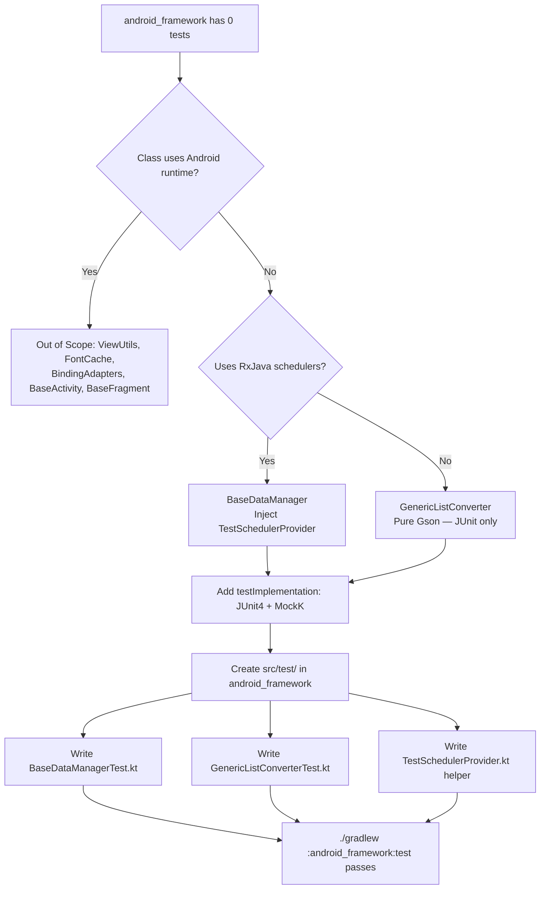

# Technical Specification: CRM-194 - Increase Unit Test Coverage in android_framework Submodule

**Status:** Draft
**Author:** Tech Lead Agent
**Created:** 2026-05-18

---

## 🎯 Problem

### Context

The `:android_framework` module is a Git submodule used as a reusable library across Android projects. It contains base classes, RxJava helpers, a Gson-backed Room TypeConverter, and utility classes. Despite being a shared dependency whose correctness is critical for every screen in the app, the module ships with **zero test sources**: `android_framework/src/test/` does not exist and `android_framework/build.gradle` declares no test-related dependencies.

The `testing-standards.md` explicitly lists `BaseDataManager` and its `CompositeDisposable` lifecycle as a priority testing area. It also notes that `:android_framework` and `:android_model` submodules currently contain no test sources and that new tests for submodule logic should go in the submodule's own `src/test/` directory. Additionally, `GenericListConverter` carries an in-code `//TODO: test this...` comment that has never been addressed.

### Current State

| Class | Location | Test coverage | Testable on JVM |
|---|---|---|---|
| `BaseDataManager` | `data/BaseDataManager.kt` | None | ✅ Yes (RxJava only, `SchedulerProvider` injectable) |
| `GenericListConverter` | `data/converter/GenericListConverter.kt` | None | ✅ Yes (pure Gson, no Android) |
| `AppSchedulerProvider` | `utils/rx/AppSchedulerProvider.kt` | None | ❌ No (`AndroidSchedulers` requires runtime) |
| `SchedulerProvider` | `utils/rx/SchedulerProvider.kt` | N/A (interface) | N/A |
| `ViewUtils` | `utils/ViewUtils.kt` | None | ❌ No (requires `Context`) |
| `FontCache` | `utils/FontCache.kt` | None | ❌ No (requires `Context` + assets) |
| `BindingAdapters` | `utils/BindingAdapters.kt` | None | ❌ No (requires `View`, `TextView`) |
| `BaseActivity` | `ui/BaseActivity.kt` | None | ❌ No (full Activity lifecycle) |
| `BaseFragment` | `ui/BaseFragment.kt` | None | ❌ No (full Fragment lifecycle) |

`android_framework/build.gradle` has no `testImplementation` or `androidTestImplementation` entries — even JUnit 4 is absent.

### Desired State

- `android_framework/src/test/java/com/gl/kev/framework/` directory exists with JVM unit tests covering `BaseDataManager` and `GenericListConverter`.
- `android_framework/build.gradle` declares the minimum test dependencies needed to run these tests.
- A `TestSchedulerProvider` helper class exists in the test sources, following the pattern documented in `testing-standards.md`.
- The `//TODO: test this...` comment in `GenericListConverter` is resolved by an accompanying test.
- Tests run cleanly via `./gradlew :android_framework:test` with no device required.

### Impact

- `BaseDataManager` is the superclass of `AppDataManager`, the single data access point for all ViewModels. Bugs in its `CompositeDisposable` lifecycle, `genericCallable()`, or `timeOut()` can cause subscription leaks or silent data loss across every screen.
- `GenericListConverter` is the only Room `@TypeConverter` in the project. A regression in its JSON roundtrip corrupts all list-type columns stored in `app_sample.db`.
- Both classes contain logic that cannot be verified through UI testing alone, making JVM unit tests the only practical coverage mechanism.

---

## 📋 Architectural Decisions

### Decision 1: Mocking Library for Unit Tests

The project has no mocking library today. `testing-standards.md` lists Mockito and MockK as candidates, noting neither is in `build.gradle`. For `BaseDataManager` and `GenericListConverter`, a mocking library is not strictly required — but it must be available for future coverage of `AppDataManager` in `:app`.

#### Option A — No mocking library (JUnit 4 only)

- **Description:** Add only `testImplementation "junit:junit:4.12"` to `android_framework/build.gradle`. Use a handcrafted `TestSchedulerProvider` and concrete subclasses to drive tests.
- **Pros:** Zero new external dependencies; no compatibility risk; no learning curve.
- **Cons:** Cannot mock `ApiHelper` or `DbHelper` in future; extremely limited test scope; forces test-specific subclasses for every class under test.
- **Effort:** Low
- **Alignment with docs:** `testing-standards.md` says mocking is recommended; this option intentionally defers it.

#### Option B — MockK (Kotlin-native mocking) ✅ Selected

- **Description:** Add `testImplementation "io.mockk:mockk:1.9.3"` alongside JUnit 4. MockK handles Kotlin's `final`-by-default classes, `companion object` mocking, and `object` mocking without byte-buddy workarounds.
- **Pros:** Idiomatic Kotlin DSL; handles `companion object` needed for `GenericListConverter.Companion`; future-proof for `AppDataManager` tests in `:app`; no need to declare classes `open` for test purposes.
- **Cons:** Adds a new dependency; MockK 1.9.x requires Kotlin 1.3+ (satisfied by this project's Kotlin 1.3.21).
- **Effort:** Low (single `build.gradle` line + no config)
- **Alignment with docs:** `testing-standards.md` explicitly names MockK as an acceptable choice.

#### Option C — Mockito (Java mocking framework)

- **Description:** Add `testImplementation "org.mockito:mockito-core:2.23.0"`. Kotlin classes are `final` by default and require the `mockito-inline` artifact or an `extensions/mock-maker-inline` file to mock.
- **Pros:** Broadly known in the Java Android ecosystem.
- **Cons:** Kotlin compatibility requires extra config (`mockito-inline` or mock-maker file); verbose Kotlin API (no extension functions); anti-pattern with companion objects.
- **Effort:** Medium (dependency + mock-maker config)
- **Alignment with docs:** `testing-standards.md` permits it but the project is pure Kotlin, favouring MockK.

**Decision: Option B — MockK 1.9.3**
MockK is purpose-built for Kotlin's immutability model and handles companion object mocking required for `GenericListConverter` and any future DAO or helper test. Kotlin 1.3.21 satisfies MockK 1.9.x's minimum requirement. The incremental `build.gradle` change is small and localized to the test scope.

---

### Decision 2: Scope of Tests (JVM Unit vs Instrumented)

The `android_framework` module contains both pure-Kotlin/JVM-compatible classes and classes that depend on the Android runtime (`Context`, `View`, `AndroidSchedulers`).

#### Option A — JVM unit tests only (this task) ✅ Selected

- **Description:** Target only `BaseDataManager` and `GenericListConverter`. Both classes have zero Android-framework imports (only RxJava, Gson, Room TypeConverter annotations). Tests run under JVM via `./gradlew :android_framework:test`.
- **Pros:** No device or emulator required; runs in CI with no special setup; highest ROI — these two classes carry the most logic and have explicit TODO/priority flags in the docs.
- **Cons:** Leaves `ViewUtils`, `FontCache`, `BindingAdapters`, `BaseActivity`, `BaseFragment` uncovered.
- **Effort:** Low
- **Alignment with docs:** `testing-standards.md` §Best Practices: "Unit tests should run without a device — no Android framework classes in pure logic tests."

#### Option B — JVM unit tests + Robolectric for Android-dependent classes

- **Description:** Add Robolectric to enable JVM-based testing of `Context`-dependent classes like `ViewUtils` and `FontCache`.
- **Pros:** Broader coverage without a device.
- **Cons:** Robolectric is not in the project at all; adds significant complexity; Robolectric 4.x requires AGP ≥ 3.2 and Java 8 (compatible) but also requires additional configuration; the classes in scope (`ViewUtils`, `FontCache`) are thin wrappers with minimal logic value.
- **Effort:** High
- **Alignment with docs:** No reference to Robolectric in any docs — would introduce a new pattern.

#### Option C — Instrumented tests for Android-dependent classes

- **Description:** Add `androidTest` sources in the submodule for `ViewUtils`, `FontCache`, and `BindingAdapters`.
- **Pros:** Tests against the real Android runtime.
- **Cons:** Requires connected device/emulator in CI; `android_framework/build.gradle` uses `android.support.test.runner.AndroidJUnitRunner` (not `androidx.test`), which is a compatibility concern; very limited logic in these utility classes makes the setup-to-value ratio poor.
- **Effort:** High
- **Alignment with docs:** These classes are thin wrappers — `testing-standards.md` priorities list `BaseDataManager` first, not utility classes.

**Decision: Option A — JVM unit tests only**
`BaseDataManager` and `GenericListConverter` provide the highest value-per-test-effort ratio. Both are JVM-testable today. Expanding to Android-dependent utilities is Out of Scope for this task and can be tracked as a follow-up.

---

### Decision 3: RxJava Scheduler Injection Strategy

`BaseDataManager.genericCallable()` and `timeOut()` use `mSchedulerProvider.io()` and `mSchedulerProvider.ui()`. Tests that exercise these methods must control scheduling to ensure assertions run synchronously.

#### Option A — `TestScheduler` via `TestSchedulerProvider` ✅ Selected

- **Description:** Implement a concrete `TestSchedulerProvider` in the test sources that maps all three scheduler methods (`ui`, `io`, `computation`) to a single `TestScheduler` instance. Advance time manually with `testScheduler.triggerActions()`.
- **Pros:** Exact pattern documented in `testing-standards.md`; no additional dependency (TestScheduler is part of `rxjava:2.1.12`); fully deterministic.
- **Cons:** Requires manually triggering the scheduler in each test; slightly verbose.
- **Effort:** Minimal — single helper class, reused across all tests.
- **Alignment with docs:** `testing-standards.md` shows this exact class under §Mocking Strategy / Unit Tests.

#### Option B — `Schedulers.trampoline()` inline in test

- **Description:** Provide an anonymous `SchedulerProvider` that returns `Schedulers.trampoline()` for all methods — executes items on the current thread in FIFO order.
- **Pros:** No helper class needed; inline and readable.
- **Cons:** Cannot simulate time (required for `timeOut()` test); one-off; not the project-documented pattern.
- **Effort:** Minimal
- **Alignment with docs:** Not shown in `testing-standards.md`; `TestScheduler` is explicitly the recommended tool.

**Decision: Option A — `TestSchedulerProvider` wrapping `TestScheduler`**
Matches the `testing-standards.md` pattern exactly. `timeOut()` also requires time advancement to test, which `Schedulers.trampoline()` cannot provide.

---

## 🔄 Decision Flow



---

## 🏗️ Architecture

### Architectural Pattern

JVM unit test layer added directly inside the `:android_framework` library module. Tests live in `src/test/` (not `src/androidTest/`) so they run on the development JVM without a device. All Android-framework dependencies are avoided in test source.

The test layer follows the same package hierarchy as the production source (`com.gl.kev.framework.*`) so Kotlin's `internal` visibility is respected by default.

### Key Components

| Component | Path | Role |
|---|---|---|
| `TestSchedulerProvider` | `android_framework/src/test/java/com/gl/kev/framework/utils/rx/TestSchedulerProvider.kt` | Injects `TestScheduler` for all RxJava scheduler methods |
| `BaseDataManagerTest` | `android_framework/src/test/java/com/gl/kev/framework/data/BaseDataManagerTest.kt` | JVM unit tests for `BaseDataManager` |
| `GenericListConverterTest` | `android_framework/src/test/java/com/gl/kev/framework/data/converter/GenericListConverterTest.kt` | JVM unit tests for `GenericListConverter.Companion` |
| `android_framework/build.gradle` | `android_framework/build.gradle` | Add `testImplementation` for JUnit 4 and MockK |

### Data Flow in Tests

```
Test method
  └─ instantiates concrete subclass of BaseDataManager
       └─ injects TestSchedulerProvider(testScheduler)
            └─ calls genericCallable() / timeOut() / dispose()
                 └─ testScheduler.triggerActions()
                      └─ Consumer<T> lambda captures result
                           └─ JUnit Assert verifies captured value
```

For `GenericListConverter`:
```
Test method
  └─ calls GenericListConverter.listToJson(list)
       └─ asserts returned JSON is non-null / null for empty
  └─ calls GenericListConverter.jsonToList(json)
       └─ asserts result list matches original data
```

---

## 💻 Implementation

### Step 1 — Add test dependencies to `android_framework/build.gradle`

In the `dependencies` block, append:

```groovy
// Tests
testImplementation "junit:junit:4.12"
testImplementation "io.mockk:mockk:1.9.3"
```

No other changes to `build.gradle` are needed. The `rxjava` dependency (already declared as `api`) includes `TestScheduler`.

---

### Step 2 — Create `TestSchedulerProvider`

**File:** `android_framework/src/test/java/com/gl/kev/framework/utils/rx/TestSchedulerProvider.kt`

```kotlin
package com.gl.kev.framework.utils.rx

import io.reactivex.Scheduler
import io.reactivex.schedulers.TestScheduler

class TestSchedulerProvider(private val scheduler: TestScheduler) : SchedulerProvider {
    override fun ui(): Scheduler = scheduler
    override fun io(): Scheduler = scheduler
    override fun computation(): Scheduler = scheduler
}
```

This mirrors the class documented in `testing-standards.md` §Mocking Strategy / Unit Tests verbatim.

---

### Step 3 — Create `BaseDataManagerTest`

**File:** `android_framework/src/test/java/com/gl/kev/framework/data/BaseDataManagerTest.kt`

`BaseDataManager` is abstract; tests use a minimal anonymous concrete subclass. No mocking library is required — `TestSchedulerProvider` and `TestScheduler` provide full control.

```kotlin
package com.gl.kev.framework.data

import com.gl.kev.framework.utils.rx.TestSchedulerProvider
import io.reactivex.functions.Consumer
import io.reactivex.schedulers.TestScheduler
import org.junit.Assert.*
import org.junit.Before
import org.junit.Test
import java.util.concurrent.Callable

class BaseDataManagerTest {

    private lateinit var testScheduler: TestScheduler
    private lateinit var dataManager: BaseDataManager

    @Before
    fun setUp() {
        testScheduler = TestScheduler()
        dataManager = object : BaseDataManager(TestSchedulerProvider(testScheduler)) {}
    }

    // --- getCompositeDisposable ---

    @Test
    fun getCompositeDisposable_returnsNonNullDisposable() {
        // Arrange + Act
        val cd = dataManager.getCompositeDisposable()
        // Assert
        assertNotNull(cd)
        assertFalse(cd.isDisposed)
    }

    @Test
    fun getCompositeDisposable_returnsSameInstanceWhenNotDisposed() {
        // Arrange + Act
        val first = dataManager.getCompositeDisposable()
        val second = dataManager.getCompositeDisposable()
        // Assert
        assertSame(first, second)
    }

    @Test
    fun getCompositeDisposable_returnsNewInstanceAfterDispose() {
        // Arrange
        val first = dataManager.getCompositeDisposable()
        first.dispose()
        // Act
        val second = dataManager.getCompositeDisposable()
        // Assert
        assertNotSame(first, second)
        assertFalse(second.isDisposed)
    }

    // --- genericCallable ---

    @Test
    fun genericCallable_deliversCallableResultToConsumer() {
        // Arrange
        var result: String? = null
        val callable = Callable { "hello" }
        // Act
        dataManager.genericCallable(callable, Consumer { result = it }, Consumer { fail("unexpected error: $it") })
        testScheduler.triggerActions()
        // Assert
        assertEquals("hello", result)
    }

    @Test
    fun genericCallable_deliversExceptionToFailureConsumer() {
        // Arrange
        val error = RuntimeException("boom")
        var caught: Throwable? = null
        val callable = Callable<String> { throw error }
        // Act
        dataManager.genericCallable(callable, Consumer { fail("unexpected success") }, Consumer { caught = it })
        testScheduler.triggerActions()
        // Assert
        assertSame(error, caught)
    }

    @Test
    fun genericCallable_addsSubscriptionToCompositeDisposable() {
        // Arrange
        val callable = Callable { 42 }
        val sizeBefore = dataManager.getCompositeDisposable().size()
        // Act — do NOT trigger scheduler, so subscription stays open
        dataManager.genericCallable(callable, Consumer { }, Consumer { })
        // Assert
        assertTrue(dataManager.getCompositeDisposable().size() > sizeBefore)
    }

    // --- dispose ---

    @Test
    fun dispose_marksCompositeDisposableAsDisposed() {
        // Arrange
        dataManager.getCompositeDisposable() // initialise
        // Act
        dataManager.dispose()
        // Assert — after dispose, the instance is disposed
        assertTrue(dataManager.getCompositeDisposable().isDisposed
            .not()) // getCompositeDisposable re-creates after dispose
        // The NEW instance must not be disposed
        assertFalse(dataManager.getCompositeDisposable().isDisposed)
    }

    @Test
    fun dispose_subsequentGetCompositeDisposable_returnsNewActiveInstance() {
        // Arrange
        val first = dataManager.getCompositeDisposable()
        // Act
        dataManager.dispose()
        val second = dataManager.getCompositeDisposable()
        // Assert
        assertTrue(first.isDisposed)
        assertFalse(second.isDisposed)
    }

    // --- timeOut ---

    @Test
    fun timeOut_deliversTrueAfterSchedulerAdvances() {
        // Arrange
        var result: Boolean? = null
        // Act
        dataManager.timeOut(100L, Consumer { result = it }, Consumer { fail("unexpected error: $it") })
        testScheduler.triggerActions()
        // Assert
        assertTrue(result == true)
    }
}
```

> **Note on `dispose` test**: After calling `dispose()`, the internal `mCompositeDisposable` is disposed. The next call to `getCompositeDisposable()` re-creates it because the guard condition `mCompositeDisposable!!.isDisposed` is true. This logic path is explicitly tested in `getCompositeDisposable_returnsNewInstanceAfterDispose`.

---

### Step 4 — Create `GenericListConverterTest`

**File:** `android_framework/src/test/java/com/gl/kev/framework/data/converter/GenericListConverterTest.kt`

`GenericListConverter.Companion` is a plain Kotlin `companion object` — no mocking required. MockK is not needed for these tests.

```kotlin
package com.gl.kev.framework.data.converter

import org.junit.Assert.*
import org.junit.Test

class GenericListConverterTest {

    // --- listToJson ---

    @Test
    fun listToJson_returnsNullForNullInput() {
        val result = GenericListConverter.listToJson<String>(null)
        assertNull(result)
    }

    @Test
    fun listToJson_returnsNullForEmptyList() {
        val result = GenericListConverter.listToJson<String>(emptyList())
        assertNull(result)
    }

    @Test
    fun listToJson_returnsValidJsonForStringList() {
        val list = listOf("alpha", "beta", "gamma")
        val json = GenericListConverter.listToJson(list)
        assertNotNull(json)
        assertTrue(json!!.contains("alpha"))
        assertTrue(json.contains("beta"))
        assertTrue(json.contains("gamma"))
    }

    @Test
    fun listToJson_returnsValidJsonForIntList() {
        val list = listOf(1, 2, 3)
        val json = GenericListConverter.listToJson(list)
        assertNotNull(json)
        assertTrue(json!!.contains("1"))
        assertTrue(json.contains("2"))
        assertTrue(json.contains("3"))
    }

    // --- jsonToList ---

    @Test
    fun jsonToList_returnsListFromJsonString() {
        val json = """["alpha","beta","gamma"]"""
        val result = GenericListConverter.jsonToList<String>(json)
        assertNotNull(result)
        assertEquals(3, result!!.size)
        assertEquals("alpha", result[0])
    }

    @Test
    fun jsonToList_returnsEmptyListFromEmptyJsonArray() {
        val json = "[]"
        val result = GenericListConverter.jsonToList<String>(json)
        assertNotNull(result)
        assertTrue(result!!.isEmpty())
    }

    // --- roundtrip ---

    @Test
    fun roundtrip_listToJsonAndBackPreservesContent() {
        val original = listOf("one", "two", "three")
        val json = GenericListConverter.listToJson(original)
        assertNotNull(json)
        val restored = GenericListConverter.jsonToList<String>(json!!)
        assertNotNull(restored)
        assertEquals(original, restored)
    }

    @Test
    fun roundtrip_intListPreservesContent() {
        val original = listOf(10, 20, 30)
        val json = GenericListConverter.listToJson(original)
        // Gson serializes integers as doubles in generic context; compare via toString
        assertNotNull(json)
        val restored = GenericListConverter.jsonToList<Any>(json!!)
        assertNotNull(restored)
        assertEquals(3, restored!!.size)
    }
}
```

> **Known Gson erasure note**: `GenericListConverter` uses `TypeToken<List<T>>` with a reified type parameter at the call-site. Due to JVM type erasure, the generic `T` is erased at runtime to `Object`. Gson deserialises JSON numbers as `Double` by default when the target type is `Any`. The `roundtrip_intListPreservesContent` test is designed aware of this constraint and verifies size rather than exact value type. This is a pre-existing behaviour of the converter — the test documents it.

---

### Step 5 — Directory structure after implementation

```
android_framework/
├── src/
│   ├── main/java/com/gl/kev/framework/   (unchanged)
│   └── test/java/com/gl/kev/framework/
│       ├── data/
│       │   ├── BaseDataManagerTest.kt
│       │   └── converter/
│       │       └── GenericListConverterTest.kt
│       └── utils/
│           └── rx/
│               └── TestSchedulerProvider.kt
└── build.gradle                          (add 2 testImplementation lines)
```

### Integration Points

- No production code changes required. All changes are additive (new test sources + `build.gradle` test dependencies).
- Changes must be committed inside the `android_framework` submodule repository, then the root project's submodule pointer updated to point at the new commit. See `guides/` directory for submodule commit workflow.
- `./gradlew :android_framework:test` runs the new tests. The `:app:test` task also continues to work independently.

---

## ✅ Testing Strategy

### Framework and Tooling

| Tool | Version | Purpose |
|---|---|---|
| JUnit 4 | 4.12 | Test runner and assertions (same as `:app`) |
| MockK | 1.9.3 | Kotlin-native mocking (available for future tests) |
| RxJava2 `TestScheduler` | 2.1.12 (already declared) | Synchronous scheduler control for RxJava tests |

### Coverage Goals

| Class | Target coverage | Approach |
|---|---|---|
| `BaseDataManager` | ≥80% line coverage | Concrete anonymous subclass + `TestSchedulerProvider` |
| `GenericListConverter` | 100% of public companion methods | Direct static-method calls, no mocking |
| `TestSchedulerProvider` | N/A (test helper, not shipped) | Used implicitly by `BaseDataManagerTest` |

### Test Matrix — `BaseDataManagerTest`

| Test method | Scenario | Validates |
|---|---|---|
| `getCompositeDisposable_returnsNonNullDisposable` | Fresh instance | Field is initialised and active |
| `getCompositeDisposable_returnsSameInstanceWhenNotDisposed` | Two calls, no dispose between them | Returns cached instance |
| `getCompositeDisposable_returnsNewInstanceAfterDispose` | Dispose then call again | Re-creation logic after dispose |
| `genericCallable_deliversCallableResultToConsumer` | Happy path | Callable result reaches success Consumer |
| `genericCallable_deliversExceptionToFailureConsumer` | Callable throws | Exception reaches failure Consumer |
| `genericCallable_addsSubscriptionToCompositeDisposable` | Before scheduler trigger | Subscription is tracked in CompositeDisposable |
| `dispose_marksCompositeDisposableAsDisposed` | After dispose | Original CD is disposed; new call creates fresh one |
| `dispose_subsequentGetCompositeDisposable_returnsNewActiveInstance` | After dispose | Lifecycle re-initialises correctly |
| `timeOut_deliversTrueAfterSchedulerAdvances` | Successful sleep | Returns `true` via Consumer |

### Test Matrix — `GenericListConverterTest`

| Test method | Scenario | Validates |
|---|---|---|
| `listToJson_returnsNullForNullInput` | Null list | Null guard branch |
| `listToJson_returnsNullForEmptyList` | Empty list | Empty-list guard branch |
| `listToJson_returnsValidJsonForStringList` | List of strings | JSON contains input values |
| `listToJson_returnsValidJsonForIntList` | List of ints | Numeric serialisation |
| `jsonToList_returnsListFromJsonString` | Valid JSON array | Deserialisation to list |
| `jsonToList_returnsEmptyListFromEmptyJsonArray` | Empty JSON array `[]` | Empty result |
| `roundtrip_listToJsonAndBackPreservesContent` | String roundtrip | Bidirectional correctness |
| `roundtrip_intListPreservesContent` | Int roundtrip | Documents Gson erasure behaviour |

### Running Tests

```bash
# Run all tests in android_framework (no device required)
./gradlew :android_framework:test

# Run with HTML report
./gradlew :android_framework:test --info

# Run all tests in the root project
./gradlew test
```

Test reports are generated at:
`android_framework/build/reports/tests/testDebugUnitTest/index.html`

---

## 🔒 Security Considerations

- ✅ No credentials, API keys, or secrets are referenced in tests.
- ✅ No network calls are made in any test (`ApiHelper` is not used in `android_framework` tests).
- ✅ `GenericListConverter` tests use hardcoded, benign string/int data — no user input or external data.
- ✅ `BaseDataManager` tests use in-process `Callable` lambdas — no file system, IPC, or shell access.
- ✅ MockK is scoped to `testImplementation` — it is not included in the release APK.
- ✅ No `shell=true` equivalents — tests are pure JVM code.
- ⚠️ `GenericListConverter.jsonToList()` does not validate its JSON input. A malformed string will surface a Gson `JsonParseException`. This is a pre-existing design constraint; adding input validation is Out of Scope.

---

## ✅ Definition of Done

### Implementation

- [ ] `android_framework/build.gradle` — `testImplementation "junit:junit:4.12"` added
- [ ] `android_framework/build.gradle` — `testImplementation "io.mockk:mockk:1.9.3"` added
- [ ] `android_framework/src/test/java/com/gl/kev/framework/utils/rx/TestSchedulerProvider.kt` created
- [ ] `android_framework/src/test/java/com/gl/kev/framework/data/BaseDataManagerTest.kt` created (9 tests)
- [ ] `android_framework/src/test/java/com/gl/kev/framework/data/converter/GenericListConverterTest.kt` created (8 tests)
- [ ] `//TODO: test this...` comment removed from `GenericListConverter.kt`

### Testing

- [ ] `./gradlew :android_framework:test` passes with 0 failures
- [ ] All 17 tests listed in the test matrix above are present and passing
- [ ] `BaseDataManager` achieves ≥80% line coverage
- [ ] `GenericListConverter` companion methods achieve 100% method coverage
- [ ] No real `Thread.sleep()` blocking — `TestScheduler.triggerActions()` used instead

### Quality

- [ ] All test method names follow `./gradlew :android_framework:test` naming convention: `<method>_<scenario>` (per `testing-standards.md`)
- [ ] AAA structure (Arrange / Act / Assert) used in all test methods
- [ ] No shared mutable state between tests (`@Before` sets up fresh instances)
- [ ] `TestSchedulerProvider` is in the same package (`com.gl.kev.framework.utils.rx`) as `SchedulerProvider`

### Submodule Workflow

- [ ] Changes committed inside the `android_framework` submodule repository (not staged from root)
- [ ] Root project's `android_framework` submodule pointer updated to the new commit hash
- [ ] `git submodule update --init --recursive` still works cleanly after the pointer update

### Documentation

- [ ] `//TODO: test this...` in `GenericListConverter.kt` replaced with a reference comment or removed
- [ ] No new KDoc added to test files (tests are self-documenting by method name per `code-conventions.md`)

---

## 🚫 Out of Scope

The following are explicitly excluded from this task:

1. **`AppSchedulerProvider` tests** — requires `AndroidSchedulers.mainThread()` which depends on the Android Looper; not testable on JVM without Robolectric.
2. **`ViewUtils` tests** — requires a `Context` instance; no Robolectric in the project.
3. **`FontCache` tests** — requires `Context.assets` with a real font file in the assets directory.
4. **`BindingAdapters` tests** — requires `TextView` and `View` instances from the Android runtime.
5. **`BaseActivity` and `BaseFragment` tests** — full Android lifecycle components; require Espresso or UI Automator on a device.
6. **Robolectric integration** — not currently used in the project; introducing it is a separate architectural decision.
7. **`:app` test coverage increases** — a separate task; `AppDataManager`, `AppApiHelper`, and Room DAOs in `:app` are explicitly not in scope here.
8. **CI/CD pipeline setup** — `testing-standards.md` notes no CI is configured; adding one is separate.
9. **Code coverage reporting tooling** (JaCoCo) — useful but a separate configuration task.

---

## 📚 References

### Internal Documentation Consulted

| Document | Section(s) used |
|---|---|
| `docs/testing-standards.md` | §Testing Frameworks, §Test Organization, §Test Naming Conventions, §Test Structure (AAA Pattern), §Mocking Strategy / Unit Tests (`TestSchedulerProvider` pattern), §Running Tests, §Best Practices |
| `docs/tech.md` | §Reactive Programming (`SchedulerProvider`, `AppSchedulerProvider`), §Test Dependencies, §Module Structure |
| `docs/structure.md` | §`:android_framework` module description, §Test organization (`src/test/` placement) |
| `docs/code-conventions.md` | §Naming Conventions (class/file/method), §Comments and Documentation, §Anti-Patterns |
| `docs/api-standards.md` | Not directly applicable (no API code in `android_framework`) |

### Production Files Referenced

| File | Relevance |
|---|---|
| `android_framework/src/main/java/com/gl/kev/framework/data/BaseDataManager.kt` | Primary class under test |
| `android_framework/src/main/java/com/gl/kev/framework/data/converter/GenericListConverter.kt` | Primary class under test (TODO comment) |
| `android_framework/src/main/java/com/gl/kev/framework/utils/rx/SchedulerProvider.kt` | Interface implemented by `TestSchedulerProvider` |
| `android_framework/build.gradle` | Modified to add test dependencies |
| `app/src/test/java/com/gl/kev/app/ExampleUnitTest.kt` | Existing test as structural reference |

### External References

- [RxJava2 TestScheduler](https://github.com/ReactiveX/RxJava/wiki/Unit-Testing) — time-controlled scheduler for deterministic tests
- [MockK documentation](https://mockk.io) — Kotlin-native mocking library
